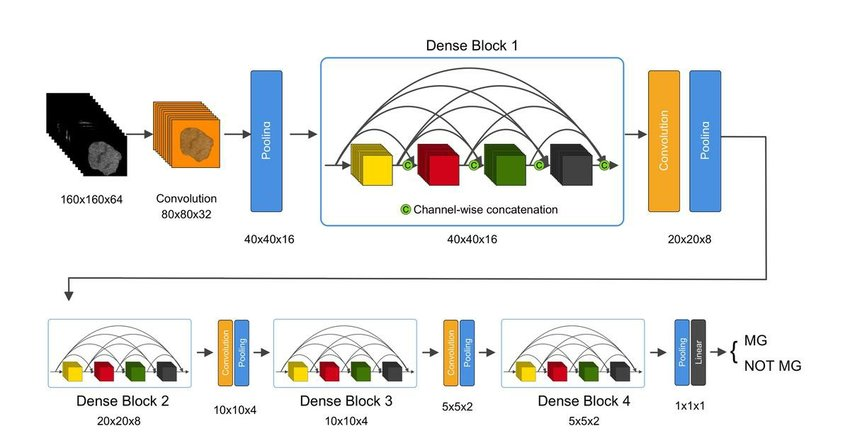

# ct-landmark-detection-densenet3d
Detect landmark for dental ct data using CNN, DenseNet3D architecture.

I implemented 47 landmark detection in dental head CT using 3D Densenet.

## Dense-net 3D
The architecture was inspired by [DenseNet, 'Densely Connected Convolutional Networks'](https://arxiv.org/abs/1608.06993)

I implemented 3D Densnet by append a dimension to the 2D-based Densnet.

## Dependencies
+ python = 3.5
+ tensorflow == 1.5.0
+ opencv-python==4.4.0.42
+ matplotlib==2.2.3
+ numpy == 1.14.5
+ scikit-image==0.14.1
+ scikit-learn==0.20.0

refer to requirements.txt

## Dataset
confidential data
+ training ct data : 150 set
+ validation ct data : 20 set

## Data processing
### dicom
- convert 16bit dicom to 8bit gray image
- scale train image size (512, 512, 460) to (224, 224, 224)
### landmark 
- Coordinate Transformation (physical -> dicom)
- Scale coordinate

## Result
+ confidential
